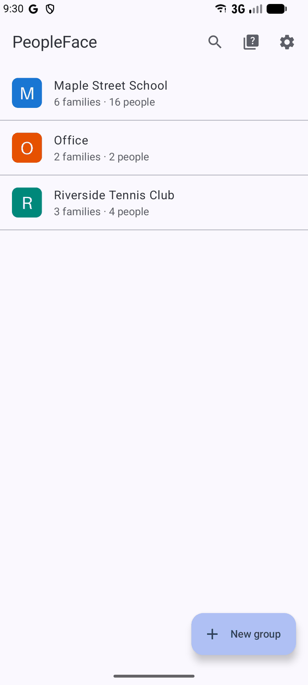
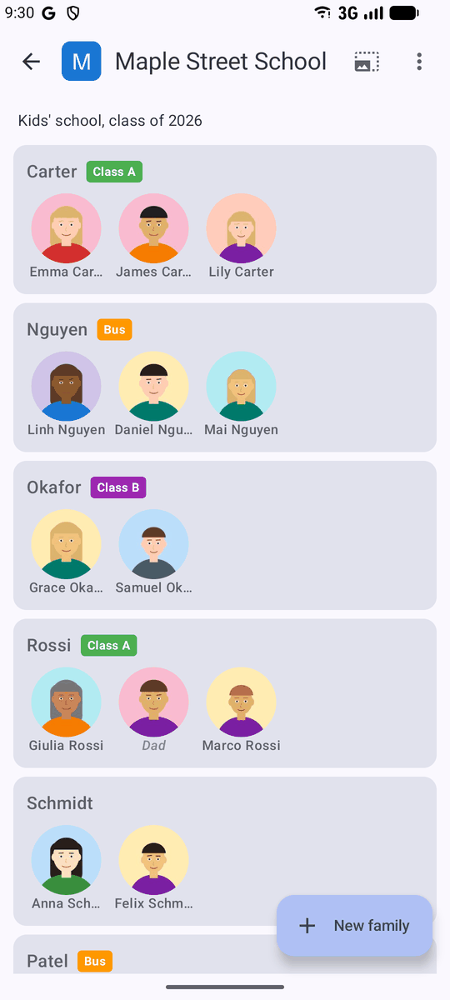
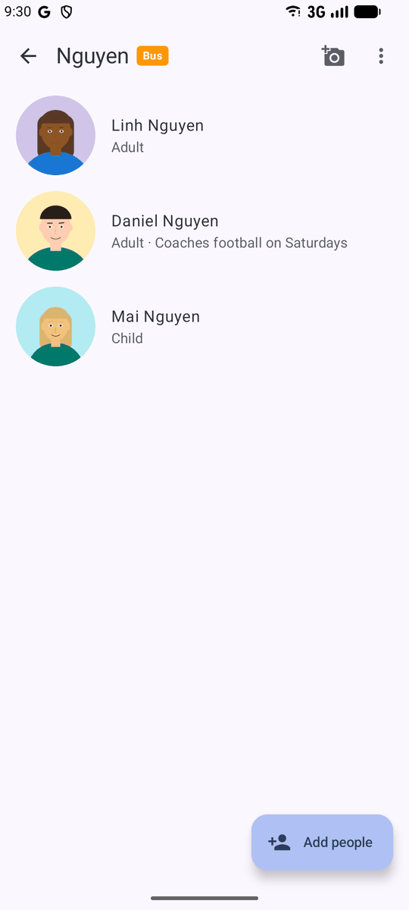
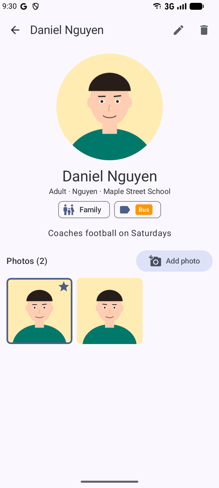
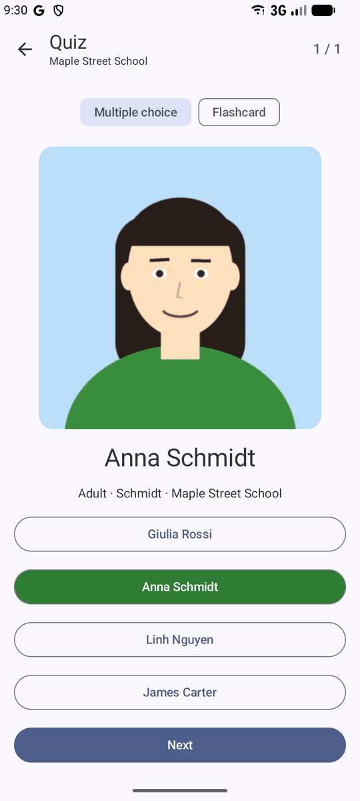
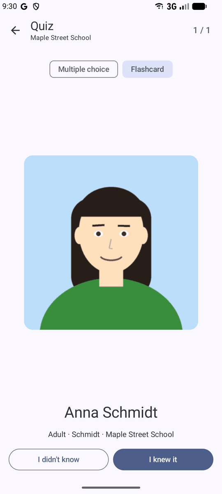
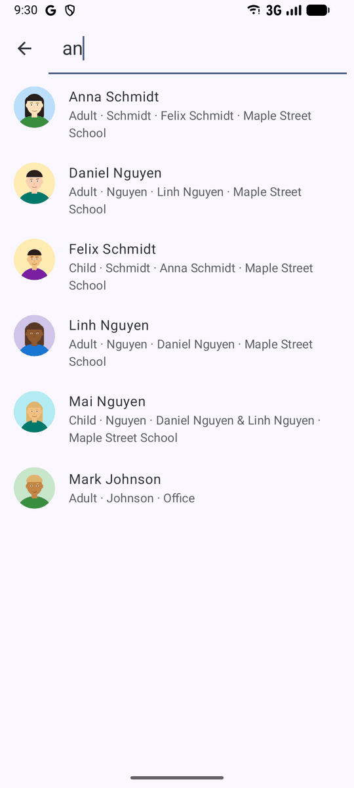
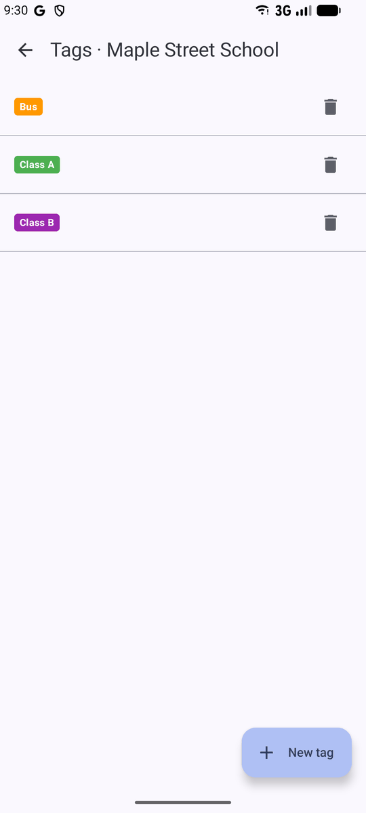
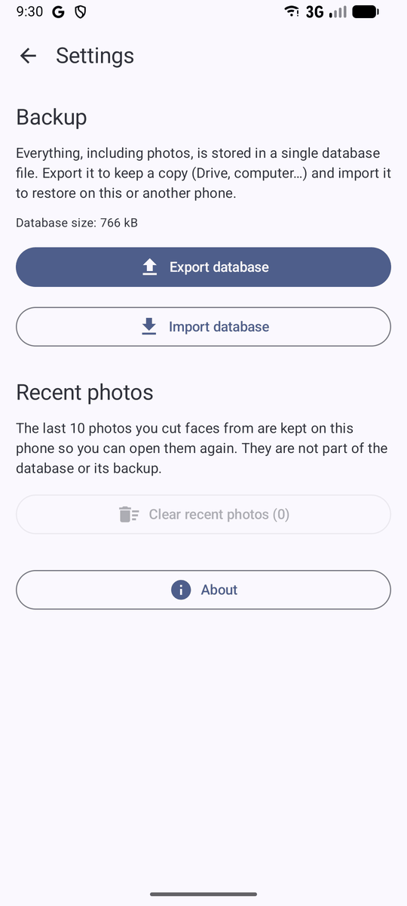

# PeopleFace

Android app to remember people's names.

- **Groups**: where people are from (kid's school, club A, club B…). A group can have an icon, cut from a
  picture like a face but without face detection (tap the icon in the group screen's title).
- **Families** inside a group: father, mother, any number of kids, or other people (grandma, nanny…).
  A family can be a single person, and the family name is optional.
  Long-press a family in the group screen and drag it to put the families in your own order.
- **Tags**: short colored labels defined per group (group menu → Tags). A family can have one tag (set on the family or person screen), shown
  next to its name, or on the person's picture for people on their own.
- **People** have a thumbnail and multiple photos. Each photo is a face cut from a larger picture:
  the app detects faces on-device (ML Kit, works offline), you tap the person you want and adjust the square if needed.
  With **Faces from a photo** on a family screen, you can cut every family member out of a single group picture.
- **Placeholder names**: when a real name isn't known yet, keep a label such as "Dad" and mark it as a placeholder
  (the ? next to the name, or the checkbox when editing). It's shown in italics and left out of search and the quiz.
- **Search** across names, families, groups, tags and notes (ignores accents).
- **Quiz**: multiple choice or flashcards, per group or across all groups.
- **Backup**: everything, including photos, lives in one SQLite file (`peopleface.db`).
  Settings → Export / Import database.
- **About**: Settings → About shows the app version, author and a link to the source code.

Only the cropped faces are stored (512 px JPEG + 192 px thumbnail); original pictures are not kept.

## Screenshots

The people in these screenshots are made-up demo data with drawn avatars.

<p>
  
  
  
  
</p>
<p>
  
  
  
  
  
</p>

## Build

Requirements: JDK 17 and the Android SDK (platform 35).

```
./gradlew assembleDebug        # app/build/outputs/apk/debug/peopleface-<version>-debug.apk
./gradlew testDebugUnitTest
```

The GitHub Actions workflow (`Build APK`) only runs when triggered manually from the Actions tab.
It publishes the debug APK as the `latest` release (replaced on every run), so it can be downloaded
from the repository's Releases page, including from a phone.

## Structure

```
app/src/main/java/com/rrgmc/peopleface/
  data/db/        Room entities, DAOs, database (origin_groups, families, persons, photos, tags)
  data/           Repository, BackupManager, AppContainer
  image/          FaceDetector (ML Kit), CropMath, ImageUtils
  ui/             Compose screens: groups, families, family, person, tags, crop, search, quiz, settings
```

## Signing

Debug builds are signed with `app/debug.keystore`, committed on purpose (password `android`, alias `androiddebugkey`),
so APKs built on any machine or in CI can be installed over each other without losing the app's data.
It is not meant for Play Store releases.
